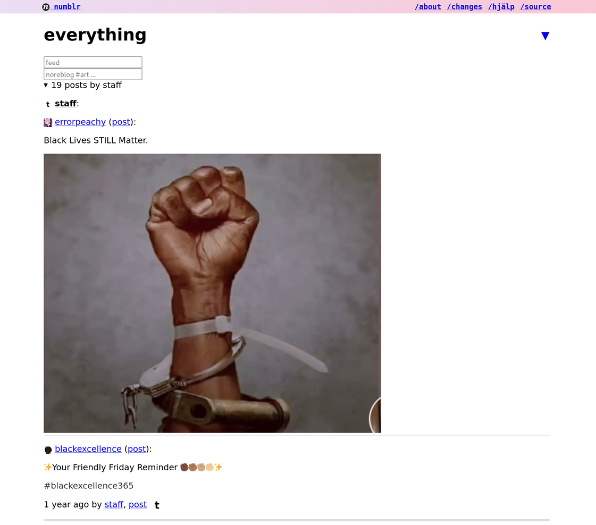

# numblr

Alternative Tumblr (and Twitter, Instagram, AO3, YouTube, RSS, ...) frontend.

Very scrappy, but usable and useful for its original author.  Please
host your own!

Inspired by [nitter](https://github.com/zedeus/nitter).

## Principles

- does not store any personal data on the server
- take back control (filter and mute with abandon)
- cookies and javascript are not necessary for use
- but subscriptions and settings can optionally saved using cookies

## Features

- ✓ rss and atom
- ✓ tumblr (via rss)
- ✓ twitter (via [nitter](https://github.com/zedeus/nitter))
- ✓ instagram (via [bibliogram](https://sr.ht/~cadence/bibliogram))
- ✓ mastodon (via rss)
- ✓ [ao3](https://archiveofourown.org) (via scraping)
- ✓ youtube (via scraping + rss)
- ✓ in-memory cache
- ✓ optional database cache
- ✓ native dark mode
- ✓ settings stored in cookie
- ✓ lists

## Known issues

- tumblr rss feeds lag behind actual content (seen up to 1+ hour delays)
- tumblr rss feeds miss content (often images and videos)
  - if a post looks like it is missing something, check the "post" link
  - and then the tumblr link if there is still more missing :/
- tumblr post view is pretty broken (because tumblr allows almost anything in there)

## Building

1. run `make` to fetch dependencies and compile
2. start using `./numblr` and visit <http://localhost:5555>

## License

This project is licensed under AGPLv3.
